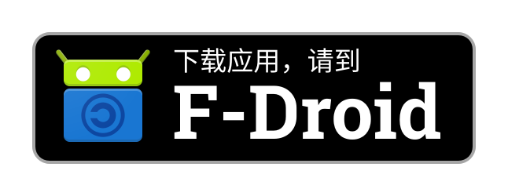

# 待办
一个简单的、遵循 Material Design 3 的待办应用，使用 Jetpack Compose 编写

> [!CAUTION]
> 近期，在 Google Play 商店中发现假冒的待办应用（非常感谢 @RohitKushvaha01 的提醒）。
>
> 已知该假冒应用未遵守`GPL-v3`协议，且在代码中添加了 [AppsFlyer](https://www.appsflyer.com/) 数据分析、相关广告服务以及联网的权限，可能会使用户的隐私收到侵犯。因此**不要去 Google Play 商店**下载待办，请从下方[下载](#️-下载)部分提到的两种官方渠道进行下载，避免个人隐私被侵犯。
>
> 同时发现其它优秀的开源项目如 [Xed-Editor](https://github.com/Xed-Editor/Xed-Editor)、[WhatSave](https://github.com/mardous/WhatSave) 也在未经原作者允许的情况下加上广告和数据分析上架到 Google Play。
>
> 这个假冒应用的出现让我十分失望。
>
> 你可以在 Google Play 商店里举报来帮助我维权，方法如下：
> 1. 在 Play 商店里打开这个假冒应用的[链接](https://play.google.com/store/apps/details?id=cn.super12138.todo)
> 2. 点击右上角的三个点（⋮），选择`举报不当内容`
> 3. 选择`让人感觉可疑的应用`并在下方点击`分享反馈`
>
> 或者，你也可以填写这个表单来帮忙进行举报：[报告违反政策的情况](https://support.google.com/googleplay/android-developer/contact/policy_violation_report)，其中：
> - `应用软件包名称`填写 `cn.super12138.todo`；
> - `涉嫌违反的政策`选择`假冒`。

> [!CAUTION]
> Recently, a counterfeit version of the To Do app was discovered on the Google Play Store (special thanks to @RohitKushvaha01 for the alert).
>
> It has been confirmed that this fake app violates the `GPL-v3` license and includes [AppsFlyer](https://www.appsflyer.com/) analytics, ads, and internet permissions in its code, potentially compromising user privacy. So, **do not download To Do from the Google Play Store**. Instead, please use one of the two official download channels mentioned in the [Download](#️-下载) section below to protect your personal data.
>
> Additionally, other excellent open-source projects like [Xed-Editor](https://github.com/Xed-Editor/Xed-Editor) and [WhatSave](https://github.com/mardous/WhatSave) have also been found on Google Play with unauthorized ads and analytics added without the original developers' consent.
>
> The appearance of this fake app has made me deeply disappointed and disheartened.
>
> You can help me by reporting the fake app on Google Play:
> 1. Open the counterfeit app’s [listing](https://play.google.com/store/apps/details?id=cn.super12138.todo);
> 2. Tap the three-dot menu (⋮) → **"Flag as inappropriate"**;
> 3. Select **"App felt suspicious"** → **"Share feedback"**.
>  
> Alternatively, submit a policy violation report [here](https://support.google.com/googleplay/android-developer/contact/policy_violation_report) with:
> - **Application package name**: `cn.super12138.todo`
> - **Suspected Policy Violation**: **"Impersonation"**

**简体中文** | [English](https://github.com/Super12138/ToDo/blob/main/README_EN.md)

# 📦 版本支持
支持 `Android 7.0 (Nougat)` 至 `Android 15.0 (VanillaIceCream)`

# ✨ 功能
- Jetpack Compose
- 基于 Material Design 3 设计的可自定义主题系统
- 多学科支持
- 任务优先级
- ……

# ⬇️ 下载
> [!IMPORTANT]
> 下方两个渠道是官方认定的安全渠道，请从这两个渠道下载待办以保证个人隐私不被侵犯。
>
> 待办不会自动更新，建议[订阅 GitHub Release 发行通知](https://docs.github.com/zh/account-and-profile/managing-subscriptions-and-notifications-on-github/setting-up-notifications/configuring-notifications#configuring-your-watch-settings-for-an-individual-repository)或者[安装 F-Droid](https://f-droid.org/) 检查更新

[前往 GitHub Release](https://github.com/Super12138/ToDo/releases/)

或者[从 F-Droid 上下载](https://f-droid.org/packages/cn.super12138.todo)

# 📸 截图
|  |  |
| --- | --- |
| 主界面（浅色） | 主界面（深色） |
|  |  |
| 添加待办 | 正在完成待办的效果 |

# 📃 许可证
[GPL-3.0-only](https://github.com/Super12138/ToDo/blob/main/LICENSE)
